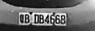

# Welcome To Raftaar.ai

----
### What is **Raftaar.ai** about?

The total strength of traffic police in India was a little over **72,000** while the number of vehicles registered was nearly **20 crore**, according to the last report of the Bureau of Police Research and Development published in 2017.

- Over speeding 
- Breaking traffic signals 
- Spotting accidents

**Raftaar.ai** will detecting the vehicle, analyzing and reporting the vehicles with not following the above criteria. And filing fines on the vehicle owners and also generating a overall detailed report for the department 

### Our Aim

#### ***To help out our traffic police force to maintain the people who commit crime.***

----
### Results

Tracking vehicls

Number Plate Detection

----
### Test the Algorithm😉

>GitHub

- 1️⃣ fork the repository📗 and give it a star🌟
- 2️⃣ pull down the repository which you have forked.
- 3️⃣ Vehicle_Tracker_Algo directory has the Tracking_Algo.py needed for vehicle tracking

----
### Credits💫

>GitHub [@RionDsilvaCS](https://github.com/RionDsilvaCS)  ·  Linkedin [@Rion Dsilva](https://www.linkedin.com/in/rion-dsilva-043464229/)

>GitHub [@puneethx](https://github.com/puneethx)        ·  Linkedin [@Puneeth Reddy](https://www.linkedin.com/in/puneeth-reddy-75069824b/)

>GitHub [@CharanArikala](https://github.com/CharanArikala)        ·  Linkedin [@Sai Charan Arikala](https://www.linkedin.com/in/sai-charan-arikala-b73178219/)

---
© 2024 Raftaar.ai